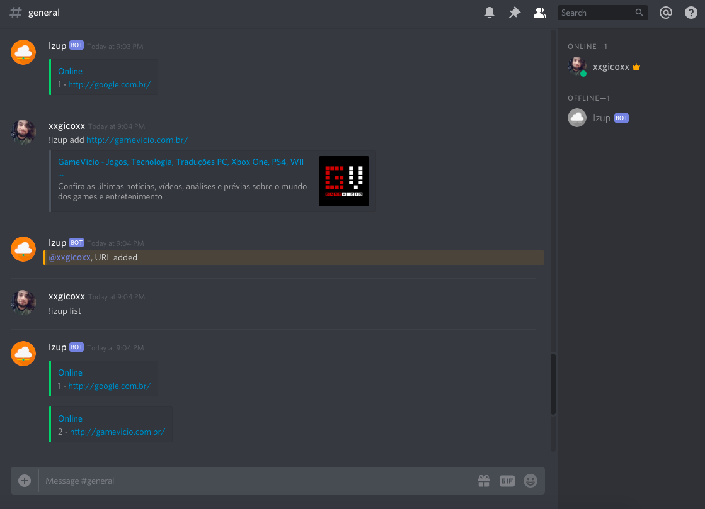

# Izup Bot
Discord bot for check your servers every five minutes.

<p align="center">
  
</p>

# Features
* !bot add `URL` - Add URL
* !bot remove `ID` - Remove URL
* !bot check `URL` - Check URL
* !bot list - List servers

# Prerequisites
* [Node.js >= 16.6.0](https://nodejs.org/en/)

# Running
### 1. Configure
````
# Bot
Create and configure .env file like .env.example.
````

### 2. Discord
````
# Create an Discord application
Create an application on https://discordapp.com/developers/applications/.

# Add a bot
Access bot option on settings menu and click on 'Add Bot' button.

# Configure
Access Applications > Settings > Bot and get your token clicking on 'Click to Reveal Token' and set 'DISCORD_TOKEN' in .env.

# Permissions
Access Applications > Settings > Bot > Privileged Gateway Intents and enable 'Message Content Intent'.
````

### 3. PostgreSQL
````
# Install
Install PostgreSQL and create an database.

# Configure
Set PostgreSQL 'POSTGRESQL_USERNAME', 'POSTGRESQL_PASSWORD', 'POSTGRESQL_DATABASE', 'POSTGRESQL_HOST' and 'POSTGRESQL_DIALECT' in .env.
````

### 4. Run
````
# Install dependencies
npm install

# Migrate
npm run migrate

# Seed
npm run seed

# Start
npm start
````

# Built With
* [Node.js](https://nodejs.org/en/)

# Authors
* [xxgicoxx](https://github.com/xxgicoxx)

# Acknowledgments
* [FlatIcon](https://www.flaticon.com/)